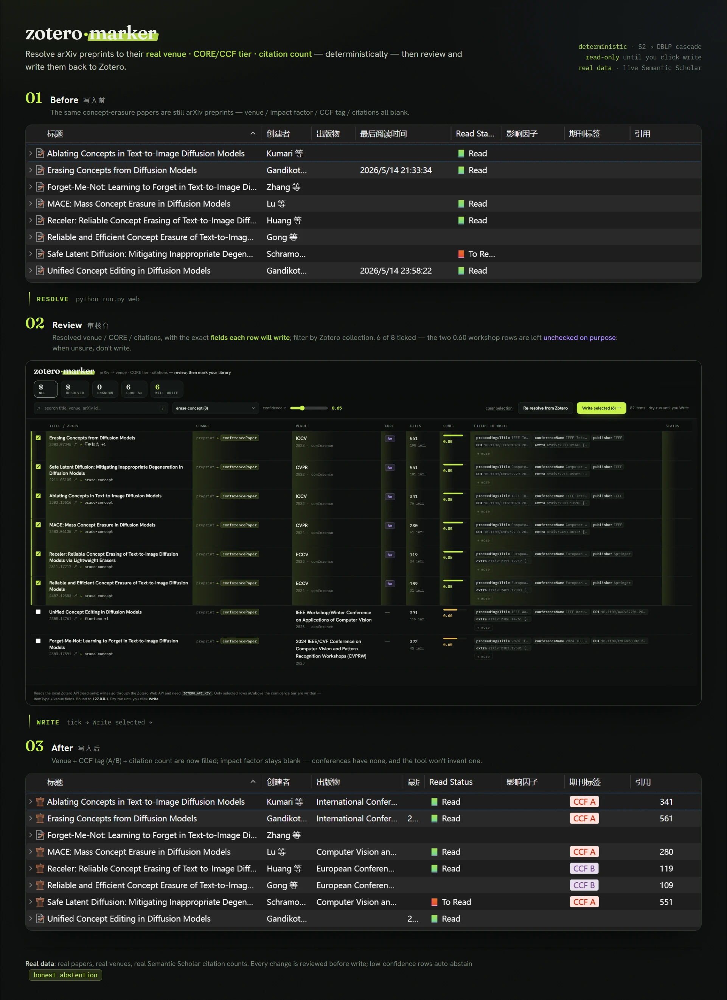
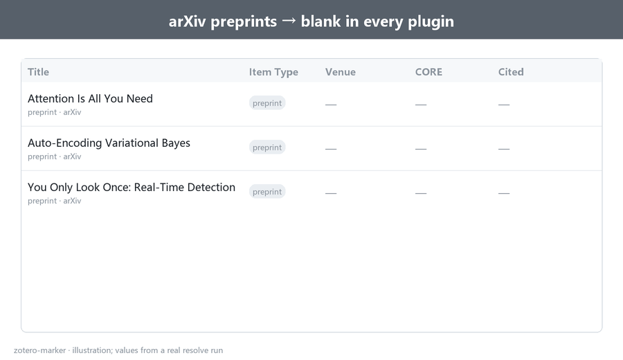

# zotero-marker


[English](README.md) | [中文](README_zh.md)



Resolve the **real publication venue** of the arXiv preprints sitting in your Zotero
library, then write it back as proper metadata — so impact-factor / journal-quartile / CCF
plugins (easyScholar, [zotero-style](https://github.com/MuiseDestiny/zotero-style) /
Ethereal Style) and citation-count columns
([Citation Tally](https://github.com/daeh/zotero-citation-tally)) light up natively.

A `preprint` in Zotero has no venue field, so those plugins show nothing for it. They read
the **venue field** (`publicationTitle` for journals; `proceedingsTitle`/`conferenceName`
for conferences) and match easyScholar by venue name + DOI — they do **not** read tags. So
zotero-marker **converts the itemType** and fills the venue + identifiers, keeping the arXiv
id and citation count in `Extra`.

It is deliberately **deterministic-first**: venues are resolved for free via Semantic
Scholar (keyed on the arXiv id) and DBLP, with ~zero hallucination. Hard cases are left for
review instead of guessed.

> **Why not the existing arXiv plugins?** They merge on the *published DOI* the author
> registered on the arXiv page. NeurIPS / ICLR / older CVPR have **no Crossref DOI** (they
> live on proceedings sites / OpenReview), so DOI-first tools miss exactly the famous
> papers. Keying on the **arXiv id → Semantic Scholar** (which dedupes preprint + published
> into one record) fixes that.

<details>
<summary>Animated walkthrough</summary>



</details>

## Install

Uses [uv](https://docs.astral.sh/uv/). Clone, then:

```bash
uv sync                       # creates .venv, installs deps (+ dev tools)
cp .env.example .env          # then edit (see below)
```

- **Zotero 7+ desktop must be running** — the tool talks to its local API at
  `localhost:23119`. Set `ZOTERO_LIBRARY_ID` in `.env` to your user/library id.
- A **Semantic Scholar API key** is optional but recommended (removes 429 rate limits):
  get one at <https://www.semanticscholar.org/product/api> and set `S2_API_KEY=...`.
- Writing back uses the **Zotero Web API** (the local API is read-only), so it needs a
  `ZOTERO_API_KEY` with write scope — create one at
  <https://www.zotero.org/settings/keys>.

## Use — CLI

**1. Resolve (dry-run, writes nothing to Zotero):**

```bash
uv run python run.py resolve                 # all preprints in the library
uv run python run.py resolve --limit 12      # first 12
uv run python run.py resolve --items GD5PM7VD,BW3RIHJ2   # specific items
```

This produces `out/resolutions.csv`, `out/resolutions.json`, and **`out/resolutions.html`** —
a self-contained review console: sortable/filterable table of every item, the exact field
changes that will be written, citations, and evidence links. Tick the rows you want and
copy the selected item keys.

**2. Write (converts itemType + fills venue fields):**

```bash
uv run python run.py write                              # dry-run: prints every proposed change
uv run python run.py write --items GD5PM7VD,2I966U5R --yes   # write only the keys you picked
uv run python run.py write --threshold 0.9 --yes        # write everything above a confidence bar
```

Only items with a resolved venue and `confidence >= threshold` are written; `unknown` items
are never touched.

## Use — web UI (optional)

A browser front-end over the same pipeline (review → tick → write, no terminal):

```bash
uv sync --extra web
uv run python run.py web        # serves http://127.0.0.1:8000
```

Bound to `127.0.0.1` only; the write action needs `ZOTERO_API_KEY` and an explicit confirm.


*Filter by Zotero collection, see the exact fields each row will write, then tick and write. Low-confidence rows (e.g. the 0.60 workshop matches) are left unchecked — the tool abstains rather than guess.*

## What gets written, and how plugins integrate

zotero-marker does not replace easyScholar, zotero-style, or Citation Tally. It fills the
Zotero fields those plugins already know how to read.

On write, it mainly changes/adds:

- **Item type** — converts `preprint` into `conferencePaper` or `journalArticle`.
- **Venue fields** — conferences get `proceedingsTitle` and `conferenceName`; journals get
  `publicationTitle`, plus `journalAbbreviation` and `ISSN` when available.
- **Identifiers and `Extra`** — preserves `arXiv:<id>`; writes `DOI` when a real published
  DOI is available; writes citation count to `Extra` in Citation Tally's readable format:
  `Citations: <N> (SemanticScholar) [date]`.

Those fields then plug into the existing ecosystem:

- **easyScholar + zotero-style** keep matching IF, journal-quartile, CCF, and related
  metadata from the venue name and DOI.
- **Citation Tally** keeps reading citation counts from `Extra`; make sure its database
  order includes Semantic Scholar so it recognizes the `Citations:` line above.

## Limitations and tradeoffs

- **Venue-name mapping is not exhaustive** — Semantic Scholar / DBLP venue names do not
  always match the exact strings easyScholar uses. This project uses `write_as` in
  `data/venue_rankings.csv` for common top venues, but it is not a complete knowledge base;
  long-tail venues may need an added mapping or a manual `data/overrides.csv` entry.
- **Citation counts are snapshots** — the tool writes the Semantic Scholar citation count
  seen during resolution into `Extra`, but there is no `refresh` mode yet for already-written
  items, so the count is not live.
- **Write-back needs external API keys** — the project itself is open source and free; DBLP
  and the Zotero local API need no key. Writing to Zotero requires a write-scoped
  `ZOTERO_API_KEY`, and heavier Semantic Scholar usage should set `S2_API_KEY` to avoid rate
  limits.
- **It is not a native Zotero plugin** — today it is a CLI / local web UI, so it has one more
  step than a right-click plugin. The upside is that the resolver is less exposed to Zotero
  plugin API churn.

## How confidence is computed

Rule-based, **not** an LLM's self-reported number:

| confidence | meaning | written by default? |
|---|---|---|
| 0.95 | ≥2 independent sources (S2 + DBLP) agree on a known venue | ✓ |
| 0.85 | one source, venue recognized in the ranking table | ✓ |
| 0.60 | a venue string was found, but it's not in the ranking table | ✗ |
| 0.00 | no venue found → `acceptance=unknown` | ✗ |

`write` only applies items at or above `--threshold` (default `0.85`). Lower it
(`--threshold 0.6`) to include shakier matches, or raise it to be stricter.

## Ranking table & overrides

`data/venue_rankings.csv` is an **editable starter** set (CORE A*/A/B/C) — extend it
freely. `data/overrides.csv` (optional, keyed by arXiv id) is the escape hatch for the long
tail the auto-resolver gets "technically right but not what you want" (e.g. a paper whose
record points at a later journal republication instead of the original conference). Overrides
always win and are labelled `source=override` in the report.

> Rankings disagree below the top tier and lag reality by years — treat any single tier as
> "source X says Y", not ground truth.

## FAQ

**Is it free?**
Yes. DBLP is free and needs no key; the Zotero local + Web APIs are free; a Semantic
Scholar key is optional (it only lifts rate limits). The tool has one runtime dependency
(`requests`).

**What is DBLP, and why use it alongside Semantic Scholar?**
[DBLP](https://dblp.org) is a free, open computer-science bibliography (maintained by
Schloss Dagstuhl). It has the best coverage of CS *conferences* — exactly where Crossref
and Semantic Scholar are weakest. zotero-marker uses it as a fallback: when S2 returns no
venue, or a later journal reprint, DBLP recovers the original conference by title + author
+ year (e.g. *Generative Adversarial Networks*: S2 says CACM, DBLP finds NeurIPS 2014).

**Does it only work on arXiv papers?**
It processes Zotero `preprint` items only — your already-published entries are never
touched. arXiv preprints get the full result (venue **and** citation count). A preprint
*without* an arXiv id can still get a venue via DBLP's title search, but no citation count
(citations come from Semantic Scholar, keyed on the arXiv id).

**Will it create duplicates or clobber my data?**
No. It never creates items — it edits existing ones in place. The `Extra` rewrite is
idempotent (it only ever rewrites lines this tool authored, so re-runs don't pile up), and
each write is guarded by the item's resolve-time version (a 412 aborts rather than
overwrite your newer edits). Nothing is written until you review and pick it. Separately,
`resolve` *flags* duplicate arXiv ids already in your library so you can merge them.

**Why does a conference paper show no impact factor?**
Impact factor is a journal/JCR metric. Conferences are ranked through systems such as CORE
and CCF, so a blank IF on a conference paper is expected.

**Why doesn't my ICLR paper get a CCF tag?**
CCF added ICLR in its 2026 (7th) edition. If easyScholar has not synced that dataset yet,
Zotero will not display the tag even when this tool writes `ICLR` correctly. Add a custom
easyScholar dataset entry if you need the tag immediately.

**Why is a paper with thousands of citations marked `unknown`?**
Because citation count and publication venue are separate facts. arXiv-only or workshop-only
papers can be highly cited, but if there is no formal conference/journal publication, there is
no canonical venue for this tool to write back.

**Why a CLI and not a Zotero plugin?**
Zotero now ships a major version roughly every 8 weeks, and plugins break on each bump
(JSM→ESM, bootstrap changes, `strict_max_version`). The resolution logic is far more
durable as a Python CLI on stable APIs. A thin Zotero plugin that *calls* this resolver is
a sensible later layer, while the resolver stays decoupled from Zotero's churn.

## Development

```bash
uv run pytest              # full suite (network is mocked; no Zotero/S2 needed)
uv run ruff check .        # lint
```

CI (GitHub Actions) runs ruff + pytest on Python 3.10–3.13. See
[CONTRIBUTING.md](CONTRIBUTING.md).

## Future work

- **Citation refresh** — update the `Citations:` line in `Extra` for items that were already
  written.
- **Harder venue cases** — add reviewable web evidence when Semantic Scholar and DBLP both
  miss.
- **Zotero plugin entry point** — provide a more native Zotero workflow while reusing the
  same resolver.

## Layout

```
run.py                      entry point: python run.py resolve|write|web
pyproject.toml              uv project + ruff/pytest config
zotero_marker/
  config.py                 .env loading + settings
  util.py                   arXiv-id extraction + title matching
  resolvers.py              Semantic Scholar (batch by arXiv id) + DBLP resolvers
  rankings.py               venue string -> canonical + CORE tier
  overrides.py              manual per-arXiv overrides
  pipeline.py               resolve cascade, venue choice, confidence, tags, dup detection
  proposal.py               itemType + field write-back (idempotent Extra)
  report.py                 CSV + JSON + HTML review console
  cli.py                    resolve / write / web commands
  web.py                    optional FastAPI web UI (the `web` extra)
  zotero_api.py             local (read) + web (write) Zotero client
data/
  venue_rankings.csv        editable CORE ranking table
  overrides.csv             optional manual overrides
tests/                      pytest suite (network mocked)
```

## License

[MIT](LICENSE).
