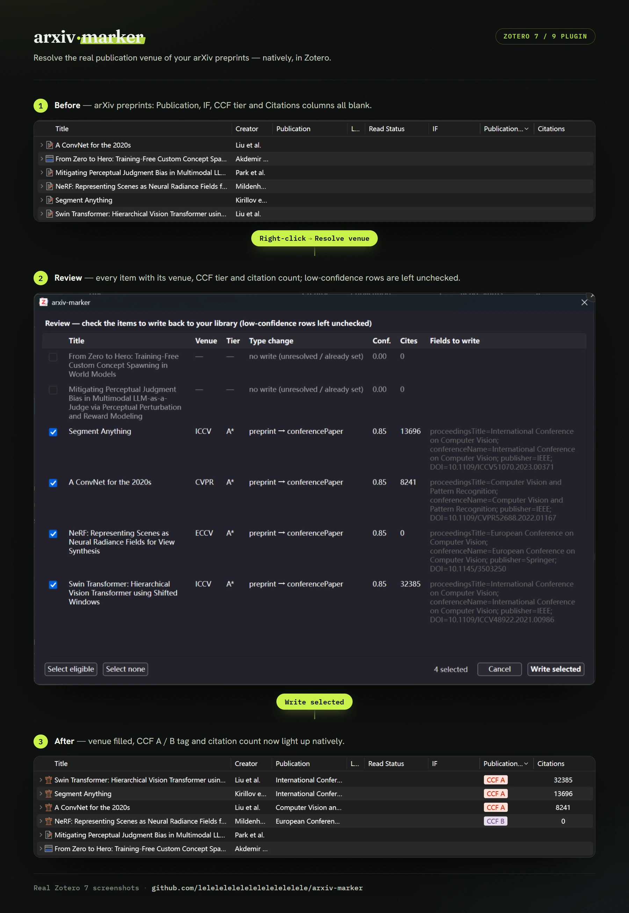

# arxiv-marker


[English](README.md) | [中文](README_zh.md)



A native **Zotero 7/9 plugin** that resolves the **real publication venue** of the arXiv
preprints in your library and writes it back as proper metadata — so impact-factor /
journal-quartile / CCF plugins ([easyScholar](https://www.easyscholar.cc/),
[zotero-style](https://github.com/MuiseDestiny/zotero-style) / Ethereal Style) and
citation-count columns ([Citation Tally](https://github.com/daeh/zotero-citation-tally))
light up natively. Select your preprints, **right-click → Resolve venue**, review every
proposed change, write the ones you want.

A `preprint` in Zotero has no venue field, so those plugins show nothing for it. They read
the **venue field** (`publicationTitle` for journals; `proceedingsTitle`/`conferenceName`
for conferences) and match easyScholar by venue name + DOI — they do **not** read tags. So
arxiv-marker **converts the itemType** and fills the venue + identifiers, keeping the arXiv
id and citation count in `Extra`.

It is deliberately **deterministic-first**: venues are resolved for free via Semantic
Scholar (keyed on the arXiv id) and DBLP, with ~zero hallucination. Hard cases are left for
review instead of guessed. Everything runs **inside Zotero** — no Python, no local server,
no Web API key.

> **Why not the existing arXiv plugins?** They merge on the *published DOI* the author
> registered on the arXiv page. NeurIPS / ICLR / older CVPR have **no Crossref DOI** (they
> live on proceedings sites / OpenReview), so DOI-first tools miss exactly the famous
> papers. Keying on the **arXiv id → Semantic Scholar** (which dedupes preprint + published
> into one record) fixes that.

## Install

1. Download the latest **`arxiv-marker-<version>.xpi`** from the
   [Releases page](https://github.com/lelelelelelelelelelelelele/arxiv-marker/releases/latest).
2. In Zotero: **Tools → Plugins** → the gear/▾ menu → **Install Plugin From File…** → pick
   the `.xpi`. (Or just drag the `.xpi` onto the Zotero window.)
3. Restart Zotero if prompted.

Requirements: **Zotero 7 or later** (works on the Zotero 9 betas too). No Python, no local
server, no API key. A **Semantic Scholar API key** is optional — add it in the plugin
preferences (**Tools → Plugins → arxiv-marker → Preferences**) to lift rate limits on large
libraries; without it the plugin still works against the public endpoint.

## Use

1. Select one or more arXiv preprints in your library.
2. **Right-click → Resolve venue with arxiv-marker** (also available under the **Tools** menu).
3. A **review dialog** lists every item with its resolved venue, CCF/CORE tier, citation
   count, and the exact fields that will be written. Rows at/above your confidence threshold
   are pre-checked; lower-confidence rows are shown but **left unchecked** — the plugin
   abstains rather than guess.
4. **Write selected** flips the item type (`preprint` → `conferencePaper` / `journalArticle`)
   and fills the venue + identifiers in place. Re-running on already-resolved items proposes
   nothing (idempotent).

> 60-second smoke test: select *Attention Is All You Need* and *LoRA*, right-click →
> Resolve venue, and you should see `NeurIPS / A*` and `ICLR / A*` with the type change and
> fields to write.

## What gets written, and how plugins integrate

arxiv-marker does not replace [easyScholar](https://www.easyscholar.cc/),
[zotero-style](https://github.com/MuiseDestiny/zotero-style), or
[Citation Tally](https://github.com/daeh/zotero-citation-tally), and is not affiliated
with them. It fills the Zotero fields those plugins already know how to read.

On write, it mainly changes/adds:

- **Item type** — converts `preprint` into `conferencePaper` or `journalArticle`.
- **Venue fields** — conferences get `proceedingsTitle` and `conferenceName`; journals get
  `publicationTitle`, plus `journalAbbreviation` and `ISSN` when available.
- **Identifiers and `Extra`** — preserves `arXiv:<id>`; writes `DOI` when a real published
  DOI is available; writes citation count to `Extra` in Citation Tally's readable format:
  `Citations: <N> (SemanticScholar) [date]`.

Those fields then plug into the existing ecosystem:

- **[easyScholar](https://www.easyscholar.cc/) +
  [zotero-style](https://github.com/MuiseDestiny/zotero-style)** keep matching IF,
  journal-quartile, CCF, and related metadata from the venue name and DOI.
- **[Citation Tally](https://github.com/daeh/zotero-citation-tally)** keeps reading
  citation counts from `Extra`; make sure its database order includes Semantic Scholar so
  it recognizes the `Citations:` line above.

## Limitations

- **Venue-name mapping is not exhaustive** — Semantic Scholar / DBLP venue names do not
  always match the exact strings easyScholar uses. This project uses `write_as` in
  `data/venue_rankings.csv` for common top venues, but it is not a complete knowledge base;
  long-tail venues may need an added mapping or a manual `data/overrides.csv` entry.
- **Citation counts are snapshots** — the plugin writes the Semantic Scholar citation count
  seen during resolution into `Extra`; there is no live refresh of already-written items yet.
- **CS/ML-focused** — arXiv + conference-as-venue + CCF/CORE are CS-specific. Other fields
  resolve venues less reliably.

## How confidence is computed

Rule-based, **not** an LLM's self-reported number:

| confidence | meaning | written by default? |
|---|---|---|
| 0.95 | ≥2 independent sources (S2 + DBLP) agree on a known venue | ✓ |
| 0.85 | one source, venue recognized in the ranking table | ✓ |
| 0.60 | a venue string was found, but it's not in the ranking table | ✗ |
| 0.00 | no venue found → `acceptance=unknown` | ✗ |

The review dialog pre-checks items at/above the confidence threshold (default `0.85`,
adjustable in preferences). Lower it to include shakier matches, or raise it to be stricter.

## Ranking table & overrides

`data/venue_rankings.csv` is an **editable starter** set (CORE A*/A/B/C) — extend it
freely. `data/overrides.csv` (optional, keyed by arXiv id) is the escape hatch for the long
tail the auto-resolver gets "technically right but not what you want" (e.g. a paper whose
record points at a later journal republication instead of the original conference). Overrides
always win and are labelled `source=override` in the report. After editing either CSV, run
`node plugin/tools/gen-data.mjs` to regenerate the plugin's embedded tables.

> Rankings disagree below the top tier and lag reality by years — treat any single tier as
> "source X says Y", not ground truth.

## Advanced — CLI & local web UI

The same deterministic resolver also ships as a Python CLI (and an optional local web UI),
for batch processing, scripting, or running headless. The plugin is a faithful port of this
resolver — the two are kept in lock-step by a [parity test](plugin/test/parity.mjs) that runs
both against live Semantic Scholar / DBLP.

Uses [uv](https://docs.astral.sh/uv/). Clone, then:

```bash
uv sync                       # creates .venv, installs deps (+ dev tools)
cp .env.example .env          # then edit (see below)
```

- **Zotero 7+ desktop must be running** — the CLI talks to its local API at
  `localhost:23119`. Set `ZOTERO_LIBRARY_ID` in `.env` to your user/library id.
- A **Semantic Scholar API key** is optional but recommended (removes 429 rate limits):
  get one at <https://www.semanticscholar.org/product/api> and set `S2_API_KEY=...`.
- Writing back from the CLI uses the **Zotero Web API** (the local API is read-only), so it
  needs a `ZOTERO_API_KEY` with write scope — create one at
  <https://www.zotero.org/settings/keys>. (The *plugin* writes locally and needs no such key.)

```bash
uv run python run.py resolve                 # dry-run: all preprints → out/resolutions.{csv,json,html}
uv run python run.py resolve --items GD5PM7VD,BW3RIHJ2   # specific items
uv run python run.py write --items GD5PM7VD,2I966U5R --yes   # write only the keys you picked
uv run python run.py write --threshold 0.9 --yes        # write everything above a confidence bar

uv sync --extra web
uv run python run.py web        # browser front-end at http://127.0.0.1:8000 (bound to localhost)
```

`out/resolutions.html` is a self-contained review console (sortable/filterable, exact field
changes, evidence links); the `web` UI is the same pipeline with a tick-and-write front-end.
Only items with a resolved venue and `confidence >= threshold` are written; `unknown` items
are never touched.

## FAQ

**Is it free?**
Yes. DBLP is free and needs no key; the Zotero APIs are free; a Semantic Scholar key is
optional (it only lifts rate limits).

**What is DBLP, and why use it alongside Semantic Scholar?**
[DBLP](https://dblp.org) is a free, open computer-science bibliography (maintained by
Schloss Dagstuhl). It has the best coverage of CS *conferences* — exactly where Crossref
and Semantic Scholar are weakest. arxiv-marker uses it as a fallback: when S2 returns no
venue, or a later journal reprint, DBLP recovers the original conference by title + author
+ year (e.g. *Generative Adversarial Networks*: S2 says CACM, DBLP finds NeurIPS 2014).

**Does it only work on arXiv papers?**
It processes Zotero `preprint` items only — your already-published entries are never
touched. arXiv preprints get the full result (venue **and** citation count). A preprint
*without* an arXiv id can still get a venue via DBLP's title search, but no citation count
(citations come from Semantic Scholar, keyed on the arXiv id).

**Will it create duplicates or clobber my data?**
No. It never creates items — it edits existing ones in place. The `Extra` rewrite is
idempotent (it only ever rewrites lines this tool authored, so re-runs don't pile up), and
nothing is written until you review and pick it. Separately, the resolver *flags* duplicate
arXiv ids already in your library so you can merge them.

**Why doesn't my ICLR paper get a CCF tag?**
CCF added ICLR in its 2026 (7th) edition. If easyScholar has not synced that dataset yet,
Zotero will not display the tag even when this tool writes `ICLR` correctly. Add a custom
easyScholar dataset entry if you need the tag immediately.

**Why is a paper with thousands of citations marked `unknown`?**
Because citation count and publication venue are separate facts. arXiv-only or workshop-only
papers can be highly cited, but if there is no formal conference/journal publication, there is
no canonical venue for this tool to write back.

**Won't the plugin break on the next Zotero version?**
Zotero ships a major version roughly every 8 weeks and plugins can break on each bump, so the
resolution logic deliberately lives in a self-contained module shared with the Python CLI;
the Zotero-facing glue is thin. If a Zotero update ever breaks the plugin, the CLI keeps
working against stable APIs while the plugin catches up.

## Development

```bash
uv run pytest              # Python resolver suite (network mocked; no Zotero/S2 needed)
uv run ruff check .        # lint
node plugin/test/unit.mjs  # ported JS resolver — deterministic unit tests
node plugin/test/parity.mjs   # live JS-vs-Python parity (needs network + the Python pkg)
powershell -ExecutionPolicy Bypass -File plugin/tools/build-xpi.ps1   # package the .xpi
```

CI (GitHub Actions) runs ruff + pytest on Python 3.10–3.13. See
[CONTRIBUTING.md](CONTRIBUTING.md).

## Future work

- **Citation refresh** — update the `Citations:` line in `Extra` for items that were already
  written.
- **Harder venue cases** — add reviewable web evidence when Semantic Scholar and DBLP both
  miss.
- **Wider field coverage** — venue resolution beyond CS/ML.

## Layout

```
plugin/                     native Zotero 7/9 plugin (the .xpi)
  manifest.json             bootstrapped plugin manifest
  bootstrap.js              registers chrome path, loads scripts
  content/
    review.xhtml            review/confirm dialog · preferences.xhtml  prefs pane
    scripts/
      resolver.js           the deterministic resolver, ported to JS
      zm-data.js            AUTO-GENERATED venue/override tables (tools/gen-data.mjs)
      arxiv-marker.js       Zotero glue (menu, item I/O, write-back)
      review.js             review dialog logic
  tools/  gen-data.mjs · build-xpi.ps1        test/  unit.mjs · parity.mjs

run.py                      CLI entry point: python run.py resolve|write|web
arxiv_marker/               the Python resolver + CLI (shared logic the plugin is ported from)
  resolvers.py · rankings.py · overrides.py · pipeline.py   resolve cascade + confidence
  proposal.py               itemType + field write-back (idempotent Extra)
  report.py · cli.py · web.py · zotero_api.py
data/
  venue_rankings.csv        editable CORE ranking table · overrides.csv  manual overrides
tests/                      pytest suite (network mocked)
```

## License

[MIT](LICENSE).
