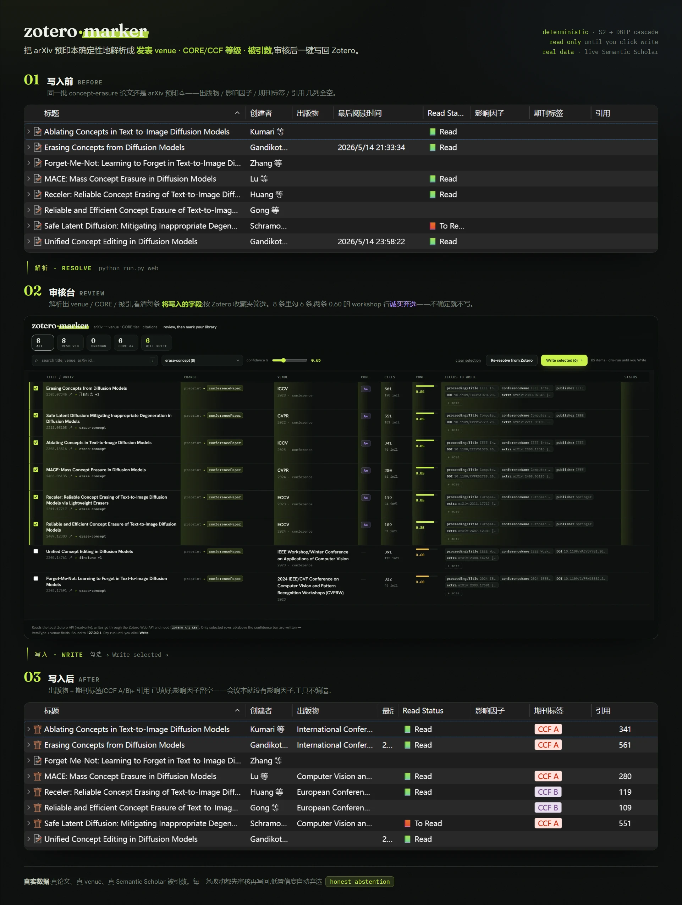
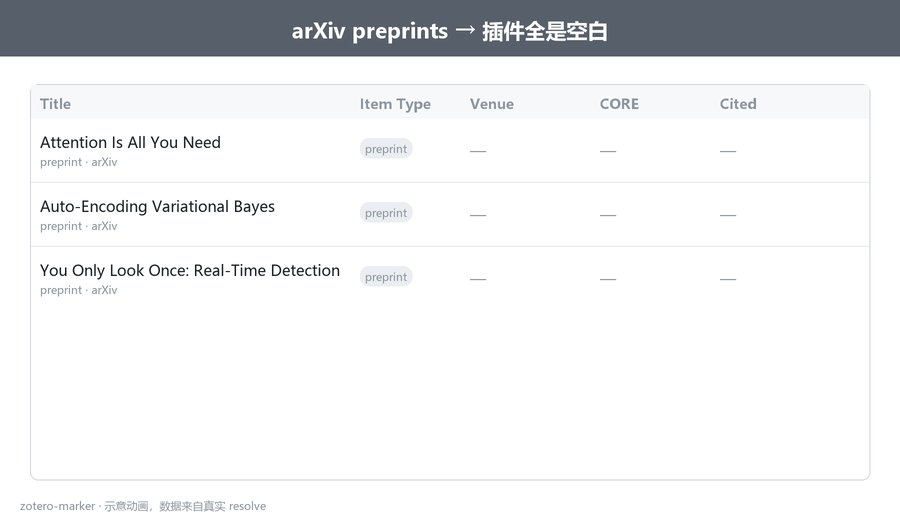
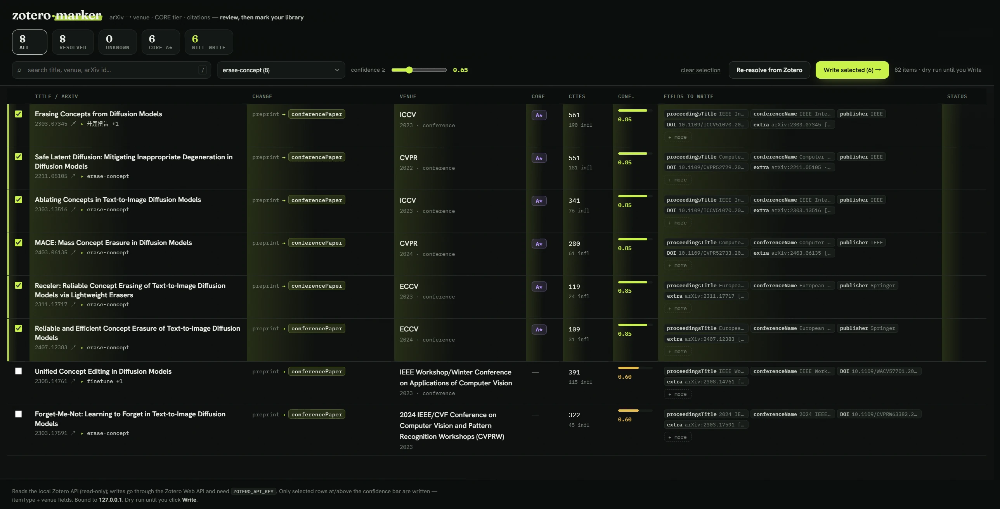

# zotero-marker


[English](README.md) | [中文](README_zh.md)



把 Zotero 里那些 arXiv `preprint` 条目的**真实发表 venue** 找出来，并写回成规范元数据。这样 easyScholar、[zotero-style](https://github.com/MuiseDestiny/zotero-style) / Ethereal Style 这类影响因子 / 分区 / CCF 插件，以及 [Citation Tally](https://github.com/daeh/zotero-citation-tally) 这类引用数列，就能像处理正式论文一样正常显示。

Zotero 的 `preprint` 类型没有 venue 字段，所以这些插件读不到任何会议或期刊信息。它们读取的是 **venue 字段**：期刊用 `publicationTitle`，会议用 `proceedingsTitle` / `conferenceName`，easyScholar 再按 venue 名称 + DOI 去匹配；它们**不会读取 tags**。因此 zotero-marker 会转换 `itemType`，填写 venue 和标识符，同时把 arXiv id 与引用数保留在 `Extra`。

它的策略是 **deterministic-first**：优先用 Semantic Scholar（按 arXiv id 查询）和 DBLP 免费解析 venue，尽量做到零幻觉。难以确认的条目会留给你审核，而不是硬猜。

> **为什么不用现有 arXiv 插件？** 它们通常依赖作者在 arXiv 页面登记的 *published DOI* 合并条目。但 NeurIPS / ICLR / 较早的 CVPR 论文很多没有 Crossref DOI（它们在 proceedings 站点或 OpenReview 上），所以 DOI-first 工具反而会漏掉这些知名论文。按 **arXiv id → Semantic Scholar** 查询，可以利用 S2 对预印本和正式发表版本的去重结果来解决这个问题。

<details>
<summary>▶ 中文动图演示</summary>



</details>

## 安装

项目使用 [uv](https://docs.astral.sh/uv/)。克隆仓库后：

```bash
uv sync                       # 创建 .venv，安装依赖和开发工具
cp .env.example .env          # 然后按下面说明编辑
```

- **需要运行 Zotero 7+ 桌面端**：工具通过 `localhost:23119` 访问 Zotero local API。请在 `.env` 里设置 `ZOTERO_LIBRARY_ID`。
- **Semantic Scholar API key 可选但推荐**：它可以减少 429 限流。到 <https://www.semanticscholar.org/product/api> 申请后设置 `S2_API_KEY=...`。
- 写回 Zotero 使用 **Zotero Web API**（local API 只读），所以需要带写权限的 `ZOTERO_API_KEY`：到 <https://www.zotero.org/settings/keys> 创建。

## 使用：CLI

**1. Resolve（dry-run，不写入 Zotero）：**

```bash
uv run python run.py resolve                 # 解析库中所有 preprint
uv run python run.py resolve --limit 12      # 只解析前 12 条
uv run python run.py resolve --items GD5PM7VD,BW3RIHJ2   # 指定条目
```

会生成 `out/resolutions.csv`、`out/resolutions.json` 和 **`out/resolutions.html`**。HTML 是一个自包含审核台：可排序、可筛选，展示每个条目将被写入的字段、引用数和证据链接。勾选要写入的行，然后点击 **复制选中的 keys**。

**2. Write（转换 itemType 并填写 venue 字段）：**

```bash
uv run python run.py write                              # dry-run：打印所有拟写入变更
uv run python run.py write --items GD5PM7VD,2I966U5R --yes   # 只写入你选中的 keys
uv run python run.py write --threshold 0.9 --yes        # 写入高于置信度门槛的条目
```

只有已解析出 venue 且 `confidence >= threshold` 的条目会被写入；`unknown` 条目永远不会被修改。

## 使用：Web UI（可选）

同一套 pipeline 的浏览器前端：review → 勾选 → write，全程不用终端。

```bash
uv sync --extra web
uv run python run.py web        # 启动 http://127.0.0.1:8000
```

服务只绑定 `127.0.0.1`；写入动作需要 `ZOTERO_API_KEY` 和显式确认。



*按 Zotero 收藏夹筛选，逐条看清将写入的字段，勾选后写入。低置信度的行（如 0.60 的 workshop 匹配）默认不勾选——拿不准就弃选，绝不瞎猜。*

## 写回哪些字段，以及如何和插件集成

zotero-marker 不替代 easyScholar、zotero-style 或 Citation Tally；它做的是把这些
插件本来就会读取的 Zotero 字段补齐。

写回时主要修改/补充这些字段：

- **条目类型**：把 `preprint` 转成 `conferencePaper` 或 `journalArticle`。
- **会议/期刊名**：会议写入 `proceedingsTitle` 和 `conferenceName`；期刊写入
  `publicationTitle`，并在能解析时补充 `journalAbbreviation`、`ISSN`。
- **标识符和 `Extra`**：保留 `arXiv:<id>`；如果解析到正式 DOI，会写入 `DOI`；引用数
  会按 Citation Tally 可读取的格式写入 `Extra`：
  `Citations: <N> (SemanticScholar) [date]`。

这些字段会自然接上现有插件：

- **easyScholar + zotero-style** 继续根据会议/期刊名和 DOI 匹配 IF、分区、CCF 等信息。
- **Citation Tally** 继续从 `Extra` 读取引用数；只要它的数据库顺序里包含 Semantic
  Scholar，就能识别上面这行 `Citations:`。

## 限制与取舍

- **会议名映射不可能覆盖所有 venue**：Semantic Scholar / DBLP 返回的 venue 名称，和
  easyScholar 实际用于匹配的名称有时不完全一致。本项目用 `data/venue_rankings.csv`
  里的 `write_as` 做常见顶会映射，但这不是完整知识库；长尾会议可能需要你补充映射或用
  `data/overrides.csv` 手动覆盖。
- **引用数是写入时的快照**：工具会把当次解析到的 Semantic Scholar 引用数写入 `Extra`，
  但目前没有 `refresh` 模式自动更新已经写回的条目，所以它不是实时引用数。
- **写回需要外部 API key**：项目本身开源、免费；DBLP 和 Zotero local API 不需要 key。
  但写回 Zotero 需要带写权限的 `ZOTERO_API_KEY`，大量使用 Semantic Scholar 时也建议配置
  `S2_API_KEY` 以避免限流。
- **它不是 Zotero 原生插件**：现在的形态是 CLI / 本地 Web UI，所以会比右键菜单插件多一
  步；好处是解析逻辑不容易被 Zotero 插件 API 的频繁变化影响。

## 置信度如何计算

规则式计算，**不是** LLM 自报分数：

| confidence | 含义 | 默认写入？ |
|---|---|---|
| 0.95 | 至少两个独立来源（S2 + DBLP）认可同一个已知 venue | ✓ |
| 0.85 | 一个来源命中，且 venue 在排名表中 | ✓ |
| 0.60 | 找到了 venue 字符串，但不在排名表中 | ✗ |
| 0.00 | 没有找到 venue → `acceptance=unknown` | ✗ |

`write` 只会应用达到 `--threshold` 的条目（默认 `0.85`）。你可以降低到
`--threshold 0.6` 接受更不稳的匹配，也可以升高门槛。

## 排名表与覆盖规则

`data/venue_rankings.csv` 是一个**可编辑的 starter set**（CORE A*/A/B/C），可以自由扩展。`data/overrides.csv`（可选，按 arXiv id 匹配）用于处理自动解析“技术上正确但不是你想要”的长尾情况，比如某篇论文记录指向后来的期刊再版，而你想保留原始会议版本。Overrides 总是优先，并会在报告里标注 `source=override`。

> 排名系统之间会不一致，而且往往滞后现实很多年。请把单个 tier 理解成“来源 X 说它是 Y”，而不是绝对真理。

## FAQ

**免费吗？**
免费。DBLP 免费且无需 key；Zotero local + Web API 免费；Semantic Scholar key 可选，只用于提高限额。运行时依赖只有一个：`requests`。

**DBLP 是什么，为什么要和 Semantic Scholar 一起用？**
[DBLP](https://dblp.org) 是免费开放的计算机科学文献数据库，由 Schloss Dagstuhl 维护。它对 CS **会议** 覆盖非常好，而会议正是 Crossref 和 Semantic Scholar 相对薄弱的地方。zotero-marker 把它作为 fallback：当 S2 没有返回 venue，或返回了后来的期刊再版时，DBLP 可以通过标题 + 作者 + 年份找回原始会议。

**只支持 arXiv 论文吗？**
工具只处理 Zotero `preprint` 条目，你已经整理好的正式出版条目不会被碰。arXiv 预印本能拿到完整结果（venue **和**引用数）。没有 arXiv id 的 preprint 仍可能通过 DBLP 标题搜索找到 venue，但不会有引用数（引用数来自 Semantic Scholar，并按 arXiv id 查询）。

**会制造重复条目或覆盖我的数据吗？**
不会。它不创建新条目，只原地编辑已有条目。`Extra` 的改写是幂等的：只重写本工具自己生成的行，所以重复运行不会堆积内容；每次写入还会用 resolve 时的 item version 做保护，若 Zotero 中条目已被你更新，412 会中止写入而不是覆盖。所有内容都要先审核再选择写入。另外，`resolve` 会标出库里已有的重复 arXiv id，方便你手动合并。

**为什么会议论文没有影响因子？**
影响因子是期刊/JCR 指标。会议通常看 CORE、CCF 等系统，所以会议论文 IF 为空是正常的。

**为什么我的 ICLR 论文没有 CCF 标签？**
CCF 在 2026 年第 7 版才加入 ICLR。如果 easyScholar 还没有同步这个数据集，即使本工具正确写入了 `ICLR`，Zotero 也不会显示标签。需要立刻显示时，可以在 easyScholar 中添加自定义数据集条目。

**为什么几千引用的论文仍然是 `unknown`？**
因为引用数和发表 venue 是两件事。arXiv-only 或 workshop-only 论文可以非常高引，但如果没有正式会议/期刊发表记录，就没有可写回的 canonical venue。

**为什么做 CLI，而不是 Zotero 插件？**
Zotero 现在大约每 8 周发布一个大版本，插件容易随着每次变更失效（JSM→ESM、bootstrap 变化、`strict_max_version` 等）。解析逻辑作为 Python CLI 跑在稳定 API 上更耐用。之后可以做一个很薄的 Zotero 插件来调用 resolver，但核心逻辑保持和 Zotero 插件生态解耦。

## 开发

```bash
uv run pytest              # 全量测试（网络已 mock，不需要 Zotero/S2）
uv run ruff check .        # lint
```

CI（GitHub Actions）会在 Python 3.10–3.13 上运行 ruff + pytest。参见 [CONTRIBUTING.md](CONTRIBUTING.md)。

## 后续可能改进

- **引用数刷新**：为已经写回的条目更新 `Extra` 里的 `Citations:` 行。
- **更强的疑难 venue 解析**：在 Semantic Scholar 和 DBLP 都找不到时，引入可审核的网页证据。
- **Zotero 插件入口**：提供更贴近 Zotero 的操作入口，同时复用现有 resolver。

## 项目结构

```text
run.py                      入口：python run.py resolve|write|web
pyproject.toml              uv 项目配置 + ruff/pytest 配置
zotero_marker/
  config.py                 .env 加载与配置
  util.py                   arXiv id 提取 + 标题匹配
  resolvers.py              Semantic Scholar（按 arXiv id batch）+ DBLP 解析器
  rankings.py               venue 字符串 -> canonical + CORE tier
  overrides.py              按 arXiv id 的手动覆盖
  pipeline.py               resolve cascade、venue 选择、confidence、tags、重复检测
  proposal.py               itemType + 字段写回（幂等 Extra）
  report.py                 CSV + JSON + HTML 审核台
  cli.py                    resolve / write / web 命令
  web.py                    可选 FastAPI Web UI（`web` extra）
  zotero_api.py             Zotero local 读取 + Web 写入客户端
data/
  venue_rankings.csv        可编辑 CORE 排名表
  overrides.csv             可选手动覆盖
tests/                      pytest 测试套件（网络 mock）
```

## License

[MIT](LICENSE)。
